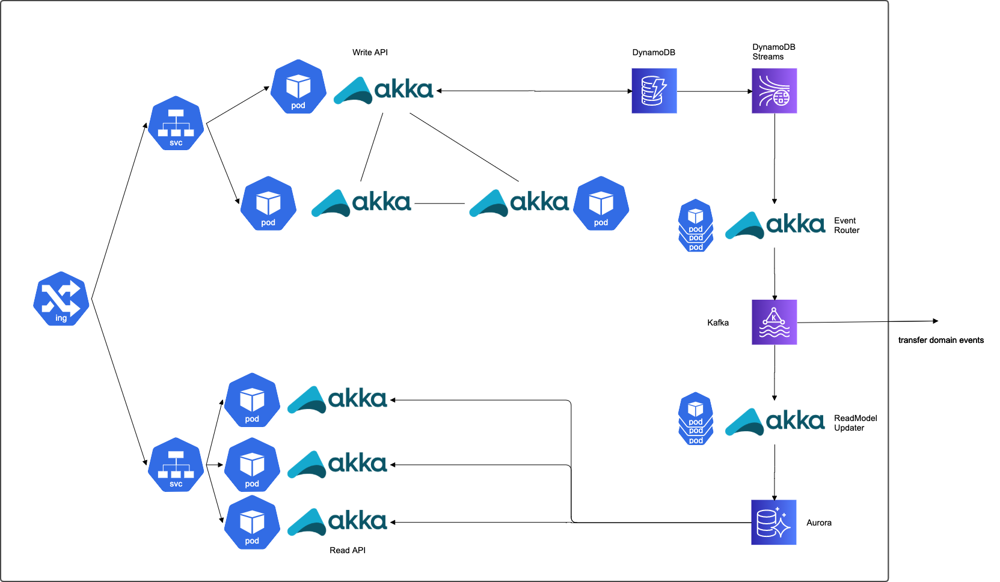

# motherbase

マザーベースとは、組織管理やアカウント管理などのサービスの基盤機能を提供するアプリケーション・プラットフォームです。

## 特徴

- DDD/Clean Architecture/CQRS+Event Sourcingをベースにしたリアクティブアーキテクチャ
- AWSで稼働する前提
- Kubernetes(EKS)対応

### なぜリアクティブ・アーキテクチャか

- ソフトウェアをインストール・稼働させるノードの数が増え、100や1000ノードになることもある。
- 扱うデータ量もギガバイト単位から、ペタバイト単位に増えた。
- 以前はデータが変化するタイミングは限定的で日次のバッチ処理などで処理されていたが、常にデータが変化するようになり、障害が起こればその間に処理できなかったデータを処理して追いつくのは困難なこともある。
- 以前は長いシステムメンテナンス時間があったが、今ではそれは受け入れられない。
- システムが利用できなかったり、応答性に問題があれば、ユーザーはよりよい他の選択肢を探し始めてしまう。解決したいのは技術的な課題ではなく、ユーザーの期待の変化である。

※ リアクティブ・アーキテクチャはリアクティブ・プログラミングとは違います。リアクティブ・アーキテクチャの実現手段ではあるが、リアクティブアーキテクチャそのものではない。

## システム構成

### アプリケーション構成

- Write API
    - akka-cluster
    - コマンド用のリクエストに応じて、集約アクターがコマンドを処理するためのAPI
    - 集約アクターはコマンドを受理すると、ドメインイベントをジャーナルデータベースに追記保存する
- Domain Event Router
    - non akka-cluster
    - ドメインイベントをDynamoDB Streamsを利用して読み込みKafkaに転送する
    外部にドメインイベントを転送する必要がなければ不要
- Read Model Updater
    - non akka-cluster
    - ドメインイベントを素にリードモデルをリードデータベースに構築する
- Read API
    - non akka-cluster
    - クエリ用のリクエストに応じて、リードモデルをクライアントに返すためのAPI

### ストレージ構成

- ジャーナルデータベース
    - DynamoDB(DynamoDB Streams)
- スナップショットデータベース
    - S3
- イベントバス
    - Kafka(MSK)
    - 外部にドメインイベントを転送する必要がなければ不要
- リードモデルデータベース
    - Aurora(RDS)
    
## 主な技術スタック

- akka 2.6
    - akka-http
    - akka-stream
    - akka-actor-typed
    - akka-persistence-typed
    - akka-cluster-typed
    - akka-cluster-sharding-typed
    - alpakka-kafka
    - aws-sdk

## アクター

- システムオーナー
    - 当該システムを運営する主体
- サービスオーナー
    - システムオーナーの許諾を受けてサービスを提供する主体
- サービスカスタマー
    - サービスオーナーの許諾を受けてサービスを利用する主体

## 機能

### アカウント管理コンテキスト

- システムオーナー向け機能
    - システムオーナー・アカウント管理
    - サービス管理
    - サービスオーナー管理
    - サービスオーナー・アカウント管理
- サービスオーナー向け機能
    - 自サービスオーナー管理
    - サービスカスタマー管理
    - サービスカスタマー・アカウント管理
- サービスカスタマー向け機能
    - 自サービスカスタマー管理
    - 自サービスカスタマー・アカウント管理
    - ポリシー管理
    - ユーザアカウント管理
    - ユーザグループ管理
    - ロール管理
